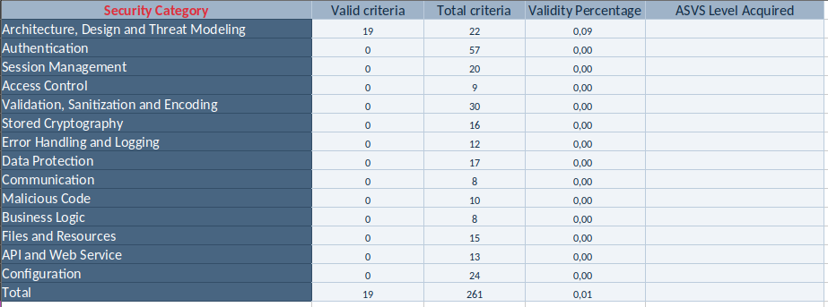
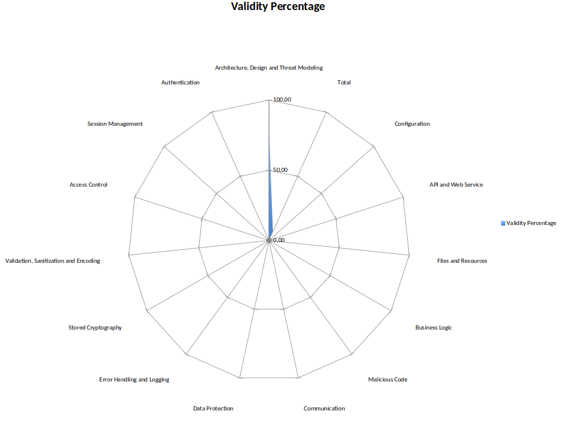

# DESOFS2025_WED_NAP_1 - Phase 1

DESOFS PROJECT TEAM: 1181031, 1190830, 1211739, 1240465, 1240466

## Introduction

Our application aims to provide an easier parking experience for our users. Through it, they can create an account, register their vehicles and gain access to parks whenever they need. Users issue parking requests, which are approved by our park managers, thus granting them permission to park their vehicle.

## Design

This section will highlight the design process and decisions.

### Functional Requirements

The following list enumerates the functional requirements of our application:
* FR01 – The system must allow user registration through the application.
* FR02 – The system must support login with two-factor authentication for registered users.
* FR03 – The user can manage their personal information (name, email, contact, vehicle information and payment details).
* FR04 – The user can cancel their account at any time.
* FR05 – The user must be able to add one or more vehicles to their account.
* FR06 – The user must be able to edit or remove vehicles associated with their account.
* FR08 – The system must allow listing nearby parking lots with their availability.
* FR09 – The park manager allows gate opening and closing based on license plate reading.
* FR10 – The user must be able to add and manage a payment method.
* FR11 – The system must record entry and exit movements to calculate the payable amount.
* FR12 – The system must allow users to pay for parking stays using the configured method.
* FR13 – The user can activate a monthly subscription, if available in the parking lot
* FR14 – The user interface must comply with WCAG accessibility guidelines.
* FR15 – The system must allow the administrator to create and configure parking lots (location, floors, types of spaces).
* FR16 – The administrator can appoint parking managers and configure pricing tables.
* FR17 – The system must allow generating usage reports and statistics for parking lots and customers.
* FR18 – The system must integrate with external payment services (e.g., MBWay, Visa).
* FR19 – The system must ensure communication between modules through RESTful APIs.

### Domain Model

In our domain model, we define four aggregates:

* The `User` Aggregate, whose root class is `User`;
* The `ParkingRequest` Aggregate, which only contains the `ParkingRequest` class, thus making it the root;
* The `Vehicle` Aggregate, which solely contains the class of the same name;
* The `Park` Aggregate, where the `Park` class is the root.

### User Roles

For our application, we define three different user roles:

1. **User** - used by regular users, meaning, clients which aim to use the app so that they can park their vehicle in one of the available parks;
2. **Park Managers** - users which manage all aspects relating to parks, such as their capacity and gate status. They are also responsible for approving Parking Requests created by regular users;
3. **Admins** - these are administrators of the parking organization, responsible for adding, chaning, and removing Park Managers from the application. 

## Client Use Cases

The use cases outline the functionalities available to a Client user in the platform. This role is designed for regular users who interact with the parking system to manage their personal accounts, vehicles, and parking preferences.

- **Create Account**: The client can register a new user account on the platform.
- **Login**: The client can authenticate and access their personal dashboard.
- **Request Car Registration**: The client can submit a request to register a new vehicle under their account.
- **Update Personal Information**: The client can modify their personal details, such as name, address, or contact.
- **Cancel Account**: The client can permanently delete their account from the system.
- **Update Car Information**: The client can modify existing details about a registered vehicle.
- **Add Payment Method**: The client can add a new payment method for future transactions.
- **Update Payment Method**: The client can change or replace an existing payment method.
- **Check Available Parks**: The client can view a list of parks currently available for use.
- **Check Available Parking Spots**: The client can check spot availability within selected parks.

### Abuse Cases Identified
- Creating an account with invalid data.
- Repeated login attempts with incorrect credentials .
- Submitting a car registration request with fake or already-registered vehicle information.
- Injecting cross-site scripting (XSS) code in info update fields.
- Attempting to update vehicle information for a car not owned by the user.
- Adding invalid payment methods to exploit the system.
- Scraping the list of available parks through automated or excessive requests.
- Simulating multiple users or sessions to overload the parking spot availability system.

---

## Park Manager Use Cases

The use cases for the Park Manager illustrate the responsibilities and features accessible to users responsible for managing parks and validating user requests.

- **Login**: The Park Manager can authenticate and access management features.
- **Create Parks**: The Park Manager can define and register new parking locations in the system.
- **Edit Parks**: The Park Manager can update details of existing parks such as capacity, hours, or pricing.
- **View Car Registration Requests**: The Park Manager can view pending car registration requests from clients.
- **View Payments**: The Park Manager can access payment records associated with their parks.
- **Approve Requests**: The Park Manager can approve car registration requests submitted by clients.
- **Reject Requests**: The Park Manager can deny car registration requests.
- **Edit Park Information**: The Park Manager can change general park settings and metadata.
- **Open/Close Gate of Each Park**: The Park Manager can remotely control the access gate to each parking location.

### Abuse Cases Identified
- Attempting to log in using administrator credentials.
- Creating parks with incorrect or fake location data.
- Deleting or modifying parks that are currently active.
- Mass approval or rejection of requests without reviewing their validity.
- Accessing customer payment information without proper authorization.
- Opening or closing gates at unauthorized times or without audit tracking.

---

## Admin Use Cases

The Admin use cases present the core administrative tasks performed by users with full platform authority. These actions typically involve user account creation and access management.

- **Create Account**: The Admin can create new accounts within the system.
- **Login**: The Admin can authenticate and access the control panel.
- **Create Park Managers**: The Admin can create new Park Manager accounts and assign permissions.

### Abuse Cases Identified
- Creating admin-level accounts without sufficient verification.
- Replacing or modifying credentials of other administrators.
- Accessing admin-only interfaces using lower-privilege accounts.

### Deployment Model

Below, we present the Implementation Diagram which details how our application will be deployed:

## Security Requirements

- Authentication:
    - Multi-Factor Authentication: email or OTP codes using an authenticator
    - Least privilege: users will not be authorized to perform any actions they are not supposed
- HTTPS between client applications and backend API
- Secure connection between API and Database
- Hashed and Salted passwords (provided by authentication service)
- Role-Based Access Control is implemented via an allow-list method: certain roles are allowed to perform certain actions, and forbidden to do all others.

## Security Test Planning

 The following aspects of the system will be tested:

* **Authentication and Authorization**:
  * Multi-factor authentication (MFA).
  * Role-based access control (RBAC).

* **Input Validation**:
  * SQL injection prevention.

* **Data Security**:
  * Data encryption (in-transit and at-rest).
  * Secure password storage (hashed and salted).

* **Security of External Integrations**:
  * Secure communication with external payment services (MBWay, Visa).

* **Access Control**:
  * Role-based access testing (Anonymous, Authenticated user, Park Manager, Admin, System Admin).

* **Security Vulnerabilities**:
  * SQL Injection, XSS, CSRF, and other OWASP Top Ten vulnerabilities.

* **Logging and Monitoring**:
  * Ensure logs are generated for security events (logins, access to sensitive data).
  * Verify the application’s ability to monitor and respond to suspicious activity.

  

### Test Strategy

Security testing will be performed using the following strategies:

* **Static Analysis**:
  * Code reviews to identify security flaws.
  * Automated static code analysis using security-focused tools (SonarQube, Checkmarx).

* **Dynamic Analysis**:
  * Manual penetration testing to identify vulnerabilities like SQL injection.
  * Automated security testing tools such as OWASP ZAP.

* **Access Control Testing**:
  * Role-based access control (RBAC) validation.
  * Verify that users with different roles (anonymous users, authenticated users, park managers, admins) can only access permitted features and data.

* **Authentication and Session Testing**:
  * Testing the multi-factor authentication process, ensuring proper working of email/OTP-based MFA.
  * Testing session management (timeouts, invalidating sessions after logout).

* **Data Protection Testing**:
  * Verifying the encryption of sensitive data both in transit (using HTTPS/TLS) and at rest.
  * Testing for proper password hashing mechanisms.

* **Integration Testing**:
  * Testing external payment gateways to ensure they are securely integrated.

* **Vulnerability Scanning**:
  * Use automated tools to scan the application for known vulnerabilities.
  * Run tests for common vulnerabilities (OWASP Top Ten).

### Test Environment

* **API Environment**:
  * The API will be hosted on a secure Linux server with the necessary firewall and security configurations.
  * Database: MySQL with necessary patches and security settings.

* **Test Tools**:
  * OWASP ZAP for dynamic testing.
  * SonarQube for static code analysis.
  * Postman for testing API endpoints.

* **Authentication Tools**:
  * Auth0 or a custom-built two-factor authentication service.

* **Security Monitoring**:
  * Implement logging and monitoring tools to ensure audit logs are generated and analyzed.

### Test Cases

#### Test Case 1: Multi-Factor Authentication

* **Objective**: Ensure the application correctly enforces multi-factor authentication.

* **Test Steps**:
1. Register as a user and attempt to log in with the correct username and password.
2. Confirm the application prompts for an OTP or email-based code.
3. Enter the correct OTP/email code and verify successful login.
4. Attempt to log in with an incorrect OTP/email code and verify the login fails.

* **Expected Results**:
  * Users are required to authenticate using both the password and OTP/email code.
  * The application denies access if the OTP/email code is incorrect.

#### Test Case 2: Role-Based Access Control (RBAC)

* **Objective**: Verify that only users with appropriate roles can access certain functionalities.

* **Test Steps**:
1. Log in as a regular user and try to access the "Manage Park" page.
2. Log in as a park manager and try to access the "Manage Park Managers" page.
3. Log in as an admin and attempt to access "Manage Park" and "Manage Park Managers".
4. Log in as a system admin and attempt to access all restricted pages.

* **Expected Results**:
  * A regular user should not access the "Manage Park" or "Manage Park Managers" page.
  * A park manager should have limited access to managing parks.
  * Only an admin or system admin should be able to manage park managers.

#### Test Case 3: SQL Injection

* **Objective**: Test for SQL Injection vulnerabilities in user input fields.

* **Test Steps**:
1. In the login form, enter the input ' OR 1=1 -- into the username or password field.

* **Expected Results**:
  * The application should reject the input, preventing unauthorized SQL commands from being executed.

  
### Risk-Based Test Coverage

The tests should prioritize high-risk areas such as:

* Authentication and access control
* External payment system integration
* Sensitive data storage and transmission
* User input validation

# Threat Model

The following section presents the threat model that was created for the application which has been described previously. It follows the [Threat Modeling Process guidelines](https://owasp.org/www-community/Threat_Modeling_Process) defined by the OWASP community.

## External Dependencies

| ID | Description                                                                                                                                                  |
|----|--------------------------------------------------------------------------------------------------------------------------------------------------------------|
| 01 | The API will be hosted on a Linux server. It will be developed in C# using the .NET Framework. This server will be subjected to regular security patches.    |
| 02 | The RDMS will be MySQL, hosted on a Linux server. This server will be subjected to regular security patches.                                                 |

## Entry Points

| ID  | Name                        | Description                                                                                                                   | Trust Levels |
|-----|-----------------------------|-------------------------------------------------------------------------------------------------------------------------------|--------------|
| 1   | HTTPS API Port              | This port will only be accessible using a communication channel protected with TLS. All other entry points stem from this one | 1,2,3,4,5             |
| 1.1 | Main Endpoint               | The default entry point for all users.                                                                                        | 1,2,3,4,5              |
| 1.2 | Create account              | A page where unauthenticated users can create an account.                                                                     | 1              |
| 1.3 | Login                       | Page where users provide login credentials in order to use functionalities which require authentication.                      | 2,3,4,5            |
| 1.4 | Update Personal Information | Page to change personal information, like vehicle data, payment methods, etc.                | 2              |
| 1.5 | Manage Park                 | Page to add, update or delete a park in the system                                                                            | 3             |
| 1.6 | Manage Park Managers        | Page to add, delete, or change information of park managers.                                            |  4            |

## Exit Points

## Assets

| ID  | Name                            | Description                                                                                                              | Trust Levels |
|-----|---------------------------------|--------------------------------------------------------------------------------------------------------------------------|--------------|
| 1   | Users                           | Assets relating to users, park managers and app administrators                                                           |              |
| 1.1 | User login details              | Login details used to authenticate a user in the application                                                             |   2,5           |
| 1.2 | Park Manager login details      | Login details used to authenticate a park manager in the application                                                     |  3,4,5            |
| 1.3 | Admin login details             | Login details used to authenticate an admin in the application                                                           |  4,5            |
| 1.4 | User payment methods            | Payment methods a user has specified to pay for parking                                                                  | 2,5             |
| 1.5 | Car details                     | Information about cars registered by users                                                                               |  2,3,5            |
| 2   | Systems                         | Assets relating to the systems through which the application is made available                                           |              |
| 2.1 | Availability of the API         | The API should be available so that users can use the application to park                                                |   5           |
| 2.2 | Availability of the Database    | The database server should be available so that the application can perform queries whenever necessary                   |  5            |
| 3   | API                             | Assets related to the Backend API                                                                                        |              |
| 3.1 | Login Session                   | The login session of a user in the API                                                                                   |  2,3,4,5            |
| 3.2 | Ability to create an account    | The ability for unregistered users to create an account in the application                                               | 1             |
| 3.3 | Ability to manage parks         | The ability to manage the parks that exist in the application - create new parks, change existing ones and delete parks. |   3           |
| 3.4 | Ability to manage park managers | The ability to add, remove, or change park managers.                                                                     |   4           |
| 3.5 | Ability to manage personal data | The ability to manage the data, such as payment information and car information.                                         |   2           |

## Trust Levels

| ID | Name                  | Description                                                                         |
|----|-----------------------|-------------------------------------------------------------------------------------|
| 1  | Anonymous user        | A user which has not yet created an account                                         |
| 2  | Authenticated user    | A user which has successfully authenticated in the application                      |
| 3  | Park Manager          | A user that can add, change or delete parks                                         |
| 4  | Administrator         | A user that can add, change or delete park managers                                 |
| 5  | Systems administrator | An administrator that configures the deployment of the application and the database |

## Data-Flow Diagram (DFD)

## STRIDE Analysis for each component

Having defined all elements in the DFD, we conducted a STRIDE analysis for each of them, wherein we detail each threat that affects our system, as well as mitigation measures for it. Having used Threat Dragon for this, we present the full threat model report in the [threatModel.pdf](./threatModel/threatModel.pdf) file.

## Risk Classification

Since we performed a STRIDE analysis for each component of the DFD, we require a systematic way of evaluating the risk score of each identified threat. For that, we used the following risk matrix:

# ASVS Checklist

The full ASVS assessment is presented in the [v4-ASVS-checklist-en.xlsx](./v4-ASVS-checklist-en.xlsx) file, with assessments on the applicability of the requirements, as well as comments and documentation references for each of those considered valid.

Below, we also present the current ASVS assessment summary for this phase of the project:

