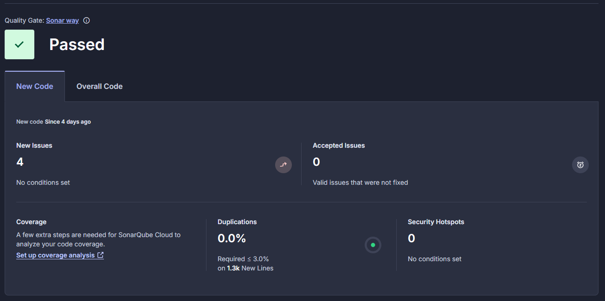

# DESOFS2025_WED_NAP_1 - Phase 2 - Sprint 1

This `README` file contains all information about developments that were done during the 1st Sprint of the 2nd Phase of the DESOFS course unit Project.

## Development

### Authentication

### Developed Use Cases

### Coding best practices

(documentar processo de code reviews, branching model - ou seja, ter branches de dev e só vai para main com um Pull Request que passe todos os testes e que seja revisto por pelo menos uma pessoa da equipa)

### Static Code Analysis

### Static Code Analysis

To ensure our code quality, maintainability, and security, we integrated **SonarCloud** into our development pipeline. SonarCloud automatically analyzes our C# codebase on each push to the `main` branch using a GitHub Actions workflow.

The workflow performs the following steps:

- **Checkout code and setup environment**

```yaml
- name: Checkout code
  uses: actions/checkout@v4

- name: Setup .NET
  uses: actions/setup-dotnet@v4
  with:
    dotnet-version: '8.0.x'  
```

- **Install SonarScanner tool and configure PATH**

```yaml
- name: Install dotnet-sonarscanner
  run: dotnet tool install --global dotnet-sonarscanner

- name: Add dotnet tools to PATH
  run: echo "$HOME/.dotnet/tools" >> $GITHUB_PATH
```

- **Begin SonarCloud analysis**

```yaml
- name: Begin SonarCloud analysis
  working-directory: ParkingSystem/ParkingSystem
  run: >
    dotnet-sonarscanner begin
    /k:"JoanaGMoreira_desofs2025_wed_nap_1"
    /o:"joanagmoreira"
    /d:sonar.token="${{ secrets.SONAR_TOKEN }}"
    /d:sonar.host.url="https://sonarcloud.io"
```

- **Restore dependencies and build solution**

```yaml
- name: Restore dependencies
  working-directory: ParkingSystem/ParkingSystem
  run: dotnet restore ParkingSystem.sln

- name: Build solution
  working-directory: ParkingSystem/ParkingSystem
  run: dotnet build ParkingSystem.sln --no-restore --no-incremental
```

- **End SonarCloud analysis**

```yaml
- name: End SonarCloud analysis
  working-directory: ParkingSystem/ParkingSystem
  run: dotnet-sonarscanner end /d:sonar.token="${{ secrets.SONAR_TOKEN }}"
```

SonarCloud provides continuous feedback on:
- Code smells
- Bugs
- Security vulnerabilities
- Test coverage

All team members are encouraged to regularly check SonarCloud reports and fix identified issues as part of the development process.

Below is an example of a SonarCloud report generated during this sprint:




### Software Composition Analysis

(falar da SBOM, a tool usada para a gerar, e respetivo worfklow. mostrar a SBOM nesta secção do relatório para termos evidências)

## Build and Test

### Execution of test plans

(falar dos testes aplicacionais que temos e de como são executados - por meio de workflow)

### Artifact Scanning

(falar do processo de build, e utilização do Trivy para analisar a imagem Docker gerada)

### Dynamic Analysis

(falar do ZAP API scan, mostrar o workflow, mostrar o relatório gerado por este processo)

### Configuration Validation

(falar de tools que temos para detetar secrets a serem pushados para o repo - temos evidências disto, é só explicar e colar)

## Pipeline Automation

(isto meio que já foi falado nos restantes pontos, portanto acho que é brevemente repetir que todos estes processos estão automatizados por meio de GitHub workflows)

## ASVS Checklist

(colar resultados gerados)

