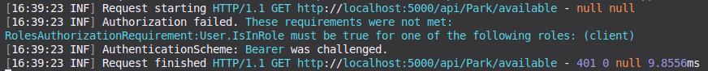
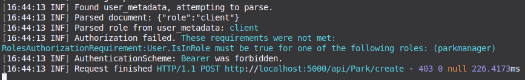
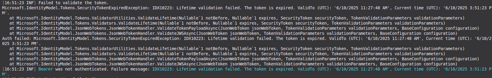
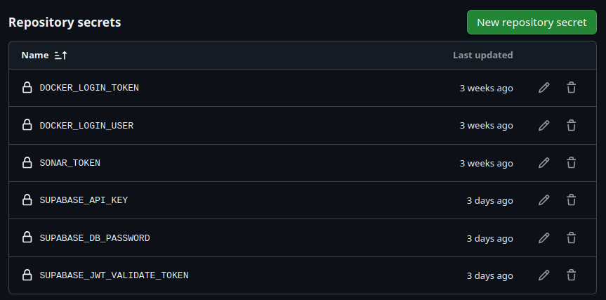
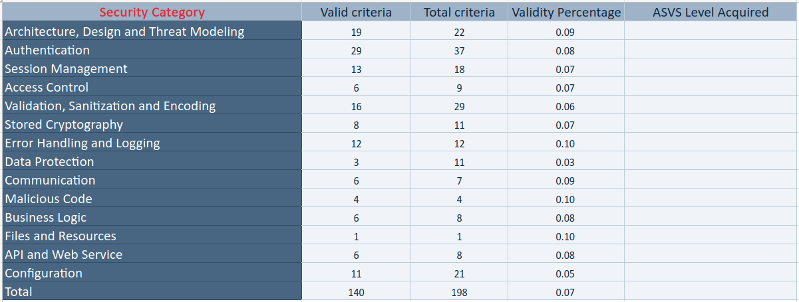

# DESOFS2025_WED_NAP_1 - Phase 2 - Sprint 2

This `README` file contains all information about developments that were done during the 2nd Sprint of the 2nd Phase of
the DESOFS course unit Project.

## Development

### Authentication - MFA

### Overview

To enhance system security, Multi-Factor Authentication was implemented using the ``TOTP (Time-based One-Time Password)`` protocol, supported via ``Supabase Auth``. This feature allows registered users to configure MFA using an authenticator app such as ``Google Authenticator``, significantly increasing protection against unauthorized access.


## MFA Flow in the System

MFA is integrated into the login process through logic that checks whether the user has an active MFA factor. The full MFA cycle is described below:

---

### 1. Initial Login (without MFA)
 - In this endpoint the user will log into their account by introducing their email and password.
```http
POST /api/auth/login
```

**Request Body:**

```json
{
  "email": "user@example.com",
  "password": "example123"
}
```

**Response if MFA is not enabled:**

```json
{
  "mfaRequired": false,
  "token": "access_token",
  "user": {
    "id": "uuid",
    "email": "user@example.com"
  },
  "mfaEnabled": false
}
```

**Response if MFA is already enabled:**

```json
{
  "mfaRequired": true,
  "factorId": "factor-uuid",
  "accessToken": "access_token",
  "message": "MFA verification required"
}
```

---

### 2. Authorize in Swagger

To access protected endpoints/ enable or disable mfa status:

- The user will have to click on the ``Authorize`` button at the top of Swagger.


- Enter the token provided when they logged in in the following format:

```
Bearer your_access_token
```

---

### 3. MFA Setup

#### Generate QR Code


```http
POST /api/auth/mfa/setup
```
- This endpoint will generate a factorId, QRCode, secret and uri, that that can be scanned with an app like ``Google Authenticator``.


**Response:**

```json
{
  "factorId": "factor-uuid",
  "friendlyName": "Authenticator App",
  "qrCode": "base64-qr-code",
  "secret": "ABC123XYZ",
  "uri": "otpauth://totp/..."
}
```

#### Scan the QR Code

- The user should open an authenticator app and scan the provided QR Code or instead can also enter the ``secret`` that was provided previously in auhtenticator applications such as ``Google Authenticator``, which will generate 6-digit TOTP codes each 30 seconds.
---

### 4. Complete MFA Setup

```http
POST /api/auth/mfa/complete-setup
```
- In this endpoint the user will fill in the code that was generated and the factorId that was provided previously.


**Request Body:**

```json
{
  "code": "123456",
  "factorId": "factor-uuid"
}
```

**Response:**

```json
{
  "message": "MFA setup completed successfully",
  "token": "new_token",
  "user": {
    "id": "uuid",
    "email": "user@example.com"
  }
}
```

---

### 5. Future Logins with MFA

After MFA is set up, future logins will return:

```json
{
  "mfaRequired": true,
  "factorId": "factor-uuid",
  "accessToken": "partial_token"
}
```

---

### 6. TOTP Code Verification

```http
POST /api/auth/verify-mfa
```
- In this endpoint the user can verify his MFA.

**Request Body:**

```json
{
  "code": "123456",
  "factorId": "factor-uuid",
  "accessToken": "partial_token"
}
```

**Response:**

```json
{
  "token": "final_access_token",
  "user": {
    "id": "uuid",
    "email": "user@example.com"
  },
  "message": "MFA verification successful"
}
```


## Relevant Code Snippets

### 1. Login

```csharp
bool hasMfaEnabled = result.user.factors.Any(f => f.Verified);

if (hasMfaEnabled)
{
    var enabledFactor = result.user.factors.First(f => f.Verified);
    return Ok(new
    {
        mfaRequired = true,
        factorId = enabledFactor.Id,
        accessToken = result.access_token,
        message = "MFA verification required"
    });
}

return Ok(new
{
    mfaRequired = false,
    token = result.access_token,
    user = new { id = result.user.id, email = result.user.email },
    mfaEnabled = false
});
````

### 2. Verify MFA

```csharp
var result = await _authService.VerifyMfa(dto.Code, dto.FactorId, dto.AccessToken);

return Ok(new
{
    token = result.access_token,
    user = new { id = result.user.id, email = result.user.email },
    message = "MFA verification successful"
});

```
### 3. Setup MFA
```csharp
var accessToken = GetAccessTokenFromHeader();

var enrollResponse = await _authService.EnrollMfaFactor(accessToken);

return Ok(new
{
factorId = enrollResponse.id,
friendlyName = enrollResponse.friendly_name,
qrCode = enrollResponse.totp.qr_code,
secret = enrollResponse.totp.secret,
uri = enrollResponse.totp.uri,
message = "Scan the QR code and enter the code to complete setup"
});
```

### 4. Complete MFA Setup
```csharp
var accessToken = GetAccessTokenFromHeader();

var result = await _authService.VerifyAndCompleteMfaEnroll(dto.Code, dto.FactorId, accessToken);

return Ok(new
{
    message = "MFA setup completed successfully",
    token = result.access_token,
    user = new { id = result.user.id, email = result.user.email }
});

```

### 5. Get MFA Status
```csharp
var accessToken = GetAccessTokenFromHeader();

var mfaStatus = await _authService.GetMfaStatus(accessToken);

return Ok(new
{
    mfaEnabled = mfaStatus.HasEnabledFactors,
    factors = mfaStatus.totp.Select(f => new
    {
        id = f.id,
        friendlyName = f.friendly_name,
        verified = f.Verified,
        status = f.status
    })
});

```

### 6. Disable MFA
```csharp
var accessToken = GetAccessTokenFromHeader();

var success = await _authService.DisableMfa(factorId, accessToken);

return success
    ? Ok(new { message = "MFA disabled successfully" })
    : BadRequest(new { message = "Failed to disable MFA" });

```

### 7. Check if MFA is Enabled
```csharp
var enabled = await _authService.IsMfaEnabled(userId);

return Ok(new { mfaEnabled = enabled });

```


### Conclusion

MFA was fully integrated using Supabase Auth and is accessible via protected Swagger endpoints. This mechanism allows users to:

- Easily activate MFA using an authenticator app
- Ensure stronger session security
- Manage or disable MFA factors as needed


### Authorization - RBAC

In this sprint we implemented authorization for our use-cases, meaning that each use case can only be executed by the role(s) permitted to do it. This heavily relies on Supabase, which is the service we chose for authentication and authorization handling.

During user creation - notably, in the [`UserService`](../../../ParkingSystem/ParkingSystem/ParkingSystem.Application/Services/UserService.cs) - the [`IAuthenticationService`](../../../ParkingSystem/ParkingSystem/ParkingSystem.Application/Interfaces/ISupabaseAuthService.cs) interface is called. This interface maps to the actual [`SupabaseAuthenticationService`](../../../ParkingSystem/ParkingSystem/ParkingSystem.Application/Services/SupabaseAuthService.cs) via dependency injection. In this iteration, this service was changed to include a `CreateUser` function, which persists the desired user in the Supabase database. This user creation also populates the `user_metadata` key of the request with the user's role, which is also persisted.

This `user_metadata` is then included in JWT tokens, which are used for authentication and consequently authorization. However, our code needs to be able to interpret this metadata, which by default it isn't. To accomplish this, a custom class [`SupabaseClaimsTransformer`](../../../ParkingSystem/ParkingSystem/ParkingSystem.Infrastructure/Authentication/SupabaseClaimsTransformer.cs) was developed. What it does is check the claim fields present in the token and, if `user_metadata` is present, it sources the role from that JSON document and sets it as a claim in the token. This makes it so that the user role - which is included in a non-default field by Supabase - is interpreted for authorization. 

Then, all that's necessary is to add the `Authorize` annotation to Controller methods - which receive requests from the client side. This was done for all implemented use cases. Below is a practical example (it's choice was arbitrary, since this is present on all use cases):

```C#
[HttpPost("add")]
[Authorize(Roles = RoleNames.Client)]
public async Task<IActionResult> AddVehicleAsync(VehicleDTO vehicleDto)
```

Having this, RBAC is operational on the defined endpoints. If a user doesn't provide an Authorization: Bearer header with a token, a 401 error code is returned and logged by the backend:



If a user does provide a valid authentication token, but is not allowed to access a specific endpoint, a 403 error code is returned and logged:



It's also worth noting that tokens are validated before validating RBAC permissions. This is configued via the following block in [`Program.cs`](../../../ParkingSystem/ParkingSystem/Program.cs):

```C#
builder.Services.AddAuthentication(JwtBearerDefaults.AuthenticationScheme)
    .AddJwtBearer(options =>
    {
        options.Authority = builder.Configuration["Supabase:Url"] + "/auth/v1";
        options.TokenValidationParameters = new TokenValidationParameters
        {
            ValidateIssuer = true,
            ValidIssuer = builder.Configuration["Supabase:Url"] + "/auth/v1",
            ValidateAudience = false,
            ValidateLifetime = true,
            ValidateIssuerSigningKey = false,
            IssuerSigningKey = jwtKeyBytes
        };
        options.RequireHttpsMetadata = true;
        options.Events = new JwtBearerEvents
        {
            OnAuthenticationFailed = context =>
            {
                Console.WriteLine($"Auth failed: {context.Exception}");
                return Task.CompletedTask;
            },
            OnTokenValidated = context =>
            {
                Console.WriteLine("Token validated successfully.");
                return Task.CompletedTask;
            }
        };
    });

builder.Services.AddAuthorization(options =>
{
    options.AddPolicy("AllRolesExceptUnauthenticated", policy =>
    {
        policy.RequireRole(RoleNames.Client, RoleNames.ParkManager, RoleNames.Admin);
    });
});
```

As an example, below we present the logs - and, consequently, the response - of a request made using an expired token:



This showcases how RBAC authorization controls were implemented in our project.

### Developed Use Cases

### Logging Mechanism

An addition for this development iteration was the implementation of a **logging mechanism** to be used throughout the code. In [`Program.cs`](../../../ParkingSystem/ParkingSystem/Program.cs), we configure the usage of Serilog, an external logging library:

```C#
builder.Host.UseSerilog((hostingContext, loggingConfig) =>
{
    loggingConfig.ReadFrom.Configuration(hostingContext.Configuration);
});
```

This loads logging configurations from our [`appsettings.json`](../../../ParkingSystem/ParkingSystem/appsettings.json):

```JSON
"Serilog": {
    "MinimumLevel": "Information",
    "Using": [ "Serilog.Sinks.Console", "Serilog.Sinks.File" ],
    "Enrich": "FromLogContext",
    "WriteTo": [
        { "Name": "Console" },
        { "Name": "File", 
        "Args": {
            "path": "./app.log",
            "rollingInterval": "Day"
        }
        }
    ]
}
```

We chose to use an external library because of its features of logging to files, most notably log rotation - in our case, per day, but this could easily be changed. Additionally, being able to configure the logging mechanism on the `appsettings.json` presents an advantage when considering the future-proofing of the applciation, as requirements could change.

Having this implemented, logs are written to a file in the application's directory, with the name of each log file being prefixed with `app`, and the current date is appended to it.

With this setup, logs are written to the file. However, the code also had to be changed to actually make use of the logging functionalities, so that we can log our custom messages to comply with requirements. For that effect, the logger is injected via DI into each class. Below we present an example for [`ParkService`](../../../ParkingSystem/ParkingSystem/ParkingSystem.Application/Services/ParkService.cs), although this is implemented in several other classes:

```C#
public ParkService(IParkRepository parkRepository, ILogger<ParkService> logger)
{
    _parkRepository = parkRepository;
    _logger = logger;
}
```

With the logger instantiated, it can then be used to log messages in the class. For example (again in [`ParkService`](../../../ParkingSystem/ParkingSystem/ParkingSystem.Application/Services/ParkService.cs), although this was chosen arbitrarily):

```C#
_logger.LogInformation("Fetching available parks");
try
{
    var parks = await _parkRepository.GetAvailableParks();
    var parkDtos = new List<ParkDTO>();
    foreach (var park in parks)
    {
        parkDtos.Add(ParkMapper.ToParkDto(park));
    }
    _logger.LogInformation("Found {Count} available parks", parkDtos.Count);
    return parkDtos;
}
catch (Exception ex)
{
    _logger.LogError("Error fetching Parks: " + ex.Message);
    // preserve the exception after logging - it's caught on the controller for return purposes
    throw;
}
```

These messages are then appropriately written to the specified log file:

```log
2025-06-04 16:52:17.198 +01:00 [INF] Found 3 available parks
2025-06-04 16:52:17.198 +01:00 [INF] Successfully gathered available parks
```
### Open/Close Gate Use Case

One of the new use cases implemented in this sprint was the **Open/Close Gate** functionality, used to simulate the physical opening and closing of parking barriers. This action is available to authenticated users with the **Park Manager** role, and is intended to be called when a vehicle is allowed or denied entry/exit from a parking location.

The functionality is implemented via two endpoints:

- `POST /gate/open/{parkId}`
- `POST /gate/close/{parkId}`

These are protected by Role-Based Access Control (RBAC), meaning only users with the required role can execute them:

```csharp
[HttpPost("open/{parkId}")]
[Authorize(Roles = RoleNames.ParkManager)]
public async Task<IActionResult> OpenGateAsync(Guid parkId)
{
    await _gateService.OpenGateAsync(parkId);
    return Ok("Gate opened successfully.");
}

[HttpPost("close/{parkId}")]
[Authorize(Roles = RoleNames.ParkManager)]
public async Task<IActionResult> CloseGateAsync(Guid parkId)
{
    await _gateService.CloseGateAsync(parkId);
    return Ok("Gate closed successfully.");
}
```

Internally, these methods call the `GateService`, which logs the operation and updates any necessary state or events associated with gate control.

Example logging output when a gate is opened:

```
2025-06-05 14:20:45.123 +01:00 [INF] Gate opened for park with ID: 781f823e-bd2d-4c41-a07d-9305a8abf973
```

This use case provides the backend control logic needed for future integration with physical hardware or simulation systems. It also demonstrates the extensibility of the system's architecture to support real-world operations tied to user roles and permissions.


## Security improvements

### Deprecation of clear-text credentials

In this sprint, we deprecated the usage of credentials in clear-text, which was reported by our CI pipeline. It reported that, in [`appsettings.json`](../../../ParkingSystem/ParkingSystem/appsettings.json), we were specifying the Supabase API key and validation token, which shouldn't be done. To solve this issue, the variables are now loaded from one of two sources: a `.env` file; or environment variables. If an environment variable is set before running the application, it is then automatically interpreted; whereas if a `.env` file is used, we use the `DotEnv.Load();` function in the initialization sequence of the app, to ensure that these are read as expected.

Then, instead of sourcing these values from the `appsettings.json` file - which we were doing before - we source them from the environment:

```C#
var dbPassword = Environment.GetEnvironmentVariable("DB_PASSWORD");
var connectionStringName = Environment.GetEnvironmentVariable("CONNECTION_STRING_ID") ?? "DefaultConnection";
var supabaseAPIKey = Environment.GetEnvironmentVariable("SUPABASE_API_KEY")!;
var supabaseJWTToken = Environment.GetEnvironmentVariable("SUPABASE_JWT_VALIDATE_TOKEN")!;
```

When it comes to the connection string, we opted not to specify it fully as an environment variable - as this is helpful in comparing definitions, as well as storing a common configuration string for the whole repository, and thus the whole team. However, the password contained therein was removed. Instead, a **placeholder value** is set:

```JSON
"SupabaseTestConnection": "Host=db.sabxpohybsfewoprvayr.supabase.co;Database=postgres;Username=postgres;Password=__PASSWORD_PLACEHOLDER__;SslMode=Require"
```

This placeholder is then substituted - in [`Program.cs`](../../../ParkingSystem/ParkingSystem/Program.cs) - with the actual value, sourced from environment variables:

```C#
builder.Services.AddDbContext<AppDbContext>(options =>
    options.UseNpgsql(builder.Configuration.GetConnectionString(connectionStringName)?.Replace("__PASSWORD_PLACEHOLDER__", dbPassword)));
```

As such, confidentiality and security of our credentials is ensured, as none of them are stored in clear-text on the repository.

The CI processes also had to be updated to be up-to-speed with this change. Notably, the `run-zap-test` job, which executes the application's container image as a service, needed to load these secrets before starting this container. For that effect, **GitHub Secrets** were used.

The required secrets were created in GitHub:



Then, the `run-zap-test` job present in the [`build_api.yaml`](../../../.github/workflows/build_api.yaml) was updated to load these secrets and set them as environment variables:

```YAML
services:
    api:
    image: 'lew6s/parking-system:0.1.0'
    ports:
        - 8080:8080
    env:
        DB_PASSWORD: ${{ secrets.SUPABASE_DB_PASSWORD }}
        CONNECTION_STRING_ID: "SupabaseTestConnection"
        SUPABASE_API_KEY: ${{ secrets.SUPABASE_API_KEY }}
        SUPABASE_JWT_VALIDATE_TOKEN: ${{ secrets.SUPABASE_JWT_VALIDATE_TOKEN }}
```

This makes it so that the new version of the application, which redacts secrets from the clear-text config, is executed successfully during testing procedures.


## Single-Read Objects

To ensure confidentiality of sensitive data, the class [`ReadOnceSecret.cs`](../../../ParkingSystem/ParkingSystem/ParkingSystem.Common/Security/ReadOnceSecret.cs) was implemented. It encapsulates data and makes it so that it can only be read once, then ensuring its full deletion from memory by filling the respective reference with `'\0'` characters. It is then used, for example when receiving passwords from the client-side and passing them on to the authentication service in [`SupabaseAuthSerice.cs`](../../../ParkingSystem/ParkingSystem/ParkingSystem.Application/Services/SupabaseAuthService.cs):

```C#
using var passwordSingle = new ReadOnceSecret(passwordInput);

var payload = new
{
    email = email,
    password = passwordSingle.Read()
};
```

The `Read()` method, after reading the value, runs `Clear()`, which replaces data in memory with the characters mentioned before, thus ensuring that no residue of this sensitive data is present in memory.

## ASVS Checklist

For this Phase and Sprint, we completed the ASVS checklist, highlighting the applicability and validity of each item with a comprehensive explanation of how it relates to our application. This artifact can be found in [`v4-ASVS-checklist-en-phase2-sprint2.xlsx`](v4-ASVS-checklist-en-phase2-sprint2.xlsx).

Below, we present the summary of this checklist in the form of a table and the generated graph:
<!-- 


 -->
